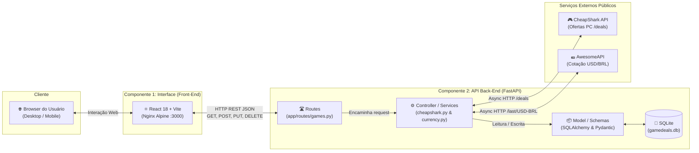

# GameDeals Vault — Interface Web (Front-End)

Interface de usuario moderna para o **GameDeals Vault**, aplicacao web para rastreamento de ofertas de jogos digitais de PC, organizacao de backlog gamer e conversao cambial automatica (USD / BRL).

Este projeto representa o **Modulo de Interface (Componente Principal)** do MVP da PUC Minas para a disciplina de Arquitetura de Sistemas Web e Componentizacao.

---

## Arquitetura do Sistema (Cenário 1 — MVC)

Conforme estabelecido nos requisitos do edital, a solução implementa a arquitetura de módulos baseada no **Cenário 1**, sumarizando todos os componentes utilizados:




### Componentes Utilizados:
* **Interface (Front-End):** React 18 + Vite servido via Nginx Alpine (porta `3000:80`).
* **API Back-End (FastAPI):** Python 3.12 com FastAPI, Uvicorn e SQLite (porta `8000:8000`).
* **Rotas e Controllers:** Roteamento REST modularizado e controllers para tratamento de regras de negócio.
* **Persistência Relacional:** SQLite via SQLAlchemy com volume Docker persistente.
* **APIs Externas Públicas:** 
  * **CheapShark API:** Catálogo de ofertas de jogos de PC e dados de lojas digitais.
  * **AwesomeAPI:** Cotação comercial oficial em tempo real do Dólar para Real (USD -> BRL).

---

## Sumario
- [Recursos e Diferenciais Visuais](#recursos-e-diferenciais-visuais-criterio-inovacao)
- [Cumprimento dos Metodos HTTP](#cumprimento-dos-metodos-http)
- [Tecnologias Utilizadas](#tecnologias-utilizadas)
- [Integracao com APIs Externas](#integracao-com-apis-externas)
- [Como Executar Localmente](#como-executar-localmente)
- [Como Executar via Docker](#como-executar-via-docker)
- [Execucao Orquestrada (Docker Compose)](#execucao-orquestrada-docker-compose)

---

## Recursos e Diferenciais Visuais (Criterio Inovacao)
* **Gamer Dark Mode:** Design imersivo construido em Vanilla CSS, com efeitos de neon, glassmorphism e micro-interacoes fluidas.
* **Seletor de Moeda (BRL / USD):** Permite ao usuario alternar entre visualizar todos os precos e economias em Reais (R$) ou Dolares ($), com badge indicador da cotacao oficial em tempo real da AwesomeAPI.
* **Dashboard de Metricas em Tempo Real:** Cartoes com contagem total de titulos, somatorio da economia acumulada (em R$ ou $), media de desconto (%) e total de jogos finalizados.
* **Busca com Tags de Sugestao:** Pesquisa interativa na API com sugestoes rapidas para franquias populares (ex: *Batman*, *The Witcher*, *Cyberpunk 2077*, *Elden Ring*).
* **Organizacao de Backlog por Status:** Filtros rapidos com contadores dinamicos (*Lista de Desejos*, *Fila do Backlog*, *Jogando*, *Zerado*).
* **Feedback Visual com Toasts:** Alertas visuais animados confirmando o sucesso ou falha de cada operacao HTTP.

---

## Cumprimento dos Metodos HTTP

A interface interage com o Back-End realizando chamadas para os 4 metodos REST obrigatorios:

1. **`GET`**:
   * Consulta de ofertas externas (`GET /api/external/deals`).
   * Listagem dos jogos salvos e estatisticas consolidadas (`GET /api/games`).
   * Consulta de cotacao de moeda (`GET /api/currency/rate`).
2. **`POST`**:
   * Adicao de novo jogo a colecao atraves do modal interativo com exibicao de valores em USD e BRL (`POST /api/games`).
3. **`PUT`**:
   * Edicao de status no backlog, avaliacao pessoal de 1 a 5 estrelas e anotacoes do jogador (`PUT /api/games/{id}`).
4. **`DELETE`**:
   * Remocao permanente do jogo do banco de dados com modal de confirmacao (`DELETE /api/games/{id}`).

---

## Tecnologias Utilizadas
* **React 18**
* **Vite 5** (Build tool de ultima geracao)
* **Vanilla CSS Moderno** (Variaveis CSS, Flexbox/Grid, Glassmorphism, responsividade pura)
* **Lucide React** (Icones vetoriais SVG)
* **Nginx Alpine** (Servidor web leve para producao no Docker)

---

## Integracao com APIs Externas

1. **CheapShark API (`https://www.cheapshark.com/api/1.0/`):**
   * Gratuita, publica e sem chave de API.
   * Utilizada para busca de ofertas e relacao de lojas parceiras.
2. **AwesomeAPI (`https://economia.awesomeapi.com.br/last/USD-BRL`):**
   * Gratuita, publica e sem chave de API.
   * Utilizada para buscar a cotacao oficial do Dolar em tempo real e converter os precos para o Real brasileiro.

---

## Como Executar Localmente

### Pre-requisitos
* Node.js 18 ou superior instalado.
* A API Back-End deve estar em execucao na porta `8000`.

### Passo a Passo

1. **Acesse a pasta do projeto:**
   ```bash
   cd gamedeals-front
   ```

2. **Instale as dependencias:**
   ```bash
   npm install
   ```

3. **Inicie o servidor de desenvolvimento:**
   ```bash
   npm run dev
   ```

4. **Acesse no navegador:**
   Abra [http://localhost:3000](http://localhost:3000)

---

## Como Executar via Docker

Como a interface utiliza o servidor web Nginx como proxy reverso para se comunicar internamente com a API (nas rotas `/api/` e `/docs`) sem problemas de CORS, ambos os contêineres se comunicam através de uma rede compartilhada do Docker (`gamedeals-network`).

### 1. Criar a rede compartilhada (caso ainda não tenha criado):
```bash
docker network create gamedeals-network
```

### 2. Garantir que a API Back-End esteja em execução na rede:
> Se ainda não iniciou a API, suba-a na pasta `gamedeals-api`:
```bash
docker run -d -p 8000:8000 --network gamedeals-network --name gamedeals-api -v gamedeals-data:/app/data -e DATABASE_URL=sqlite:///./data/gamedeals.db gamedeals-api
```

### 3. Construir a imagem da Interface:
```bash
docker build -t gamedeals-front .
```

### 4. Executar o container do Front-End na rede:
```bash
docker run -d -p 3000:80 --network gamedeals-network --name gamedeals-front gamedeals-front
```

### 5. Acessar no navegador:
* Interface Web: [http://localhost:3000](http://localhost:3000)
* Documentação da API via proxy reverso: [http://localhost:3000/docs](http://localhost:3000/docs)

### 6. Ver logs e parar o container:
```bash
# Visualizar logs em tempo real:
docker logs -f gamedeals-front

# Parar e remover o container:
docker stop gamedeals-front && docker rm gamedeals-front
```

---

## Execucao Orquestrada (Docker Compose)

Conforme a **Observacao 2** do edital, o arquivo `docker-compose.yml` esta disponibilizado na raiz deste repositorio da Interface para subir toda a stack (Back-End + Front-End) com um unico comando:

```bash
docker compose up --build
```

* **Front-End:** [http://localhost:3000](http://localhost:3000)
* **Back-End (Swagger):** [http://localhost:8000/docs](http://localhost:8000/docs)
